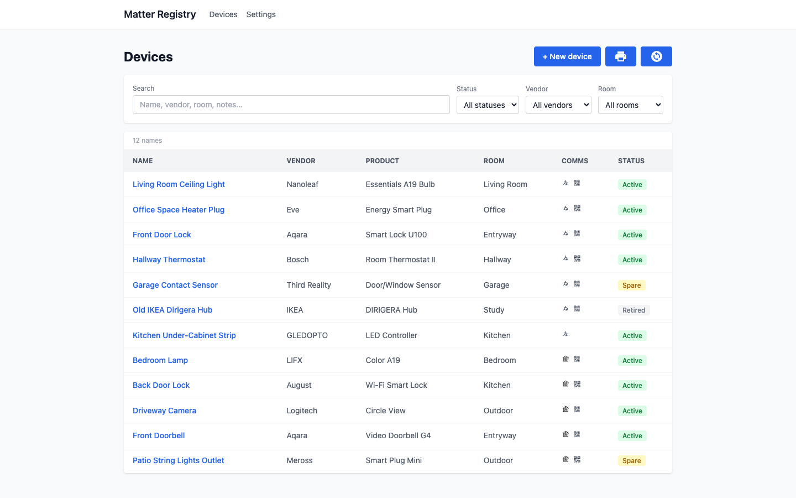
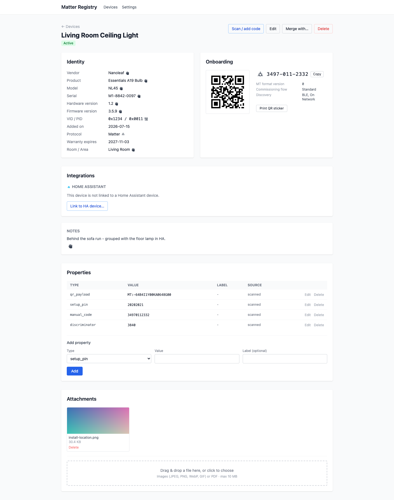
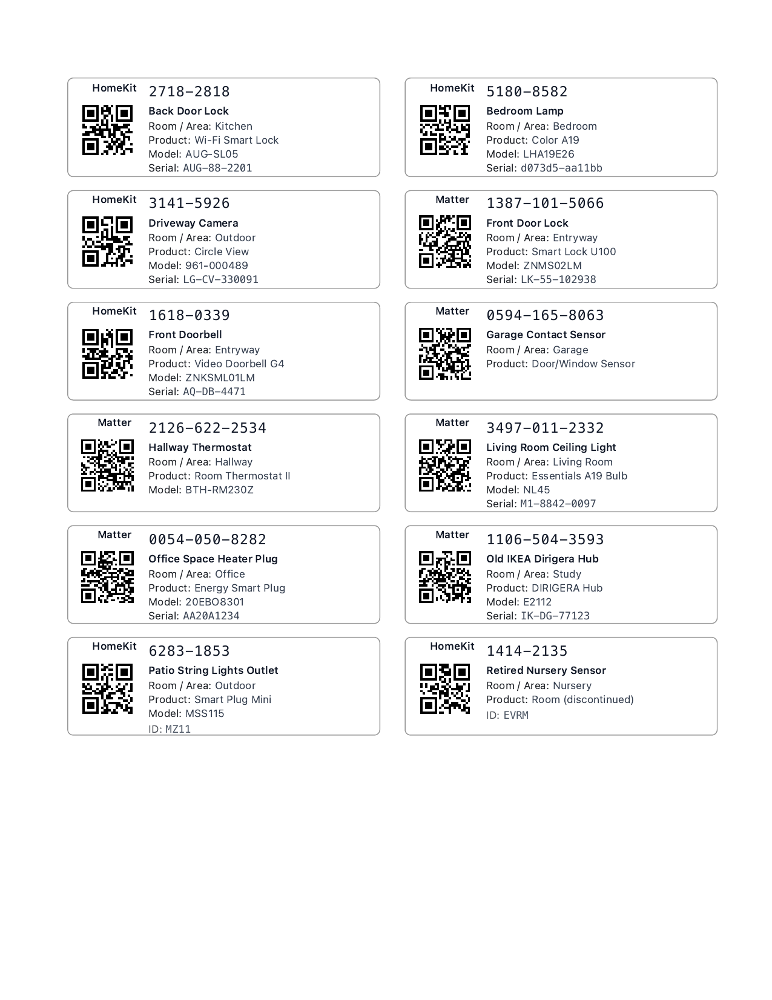
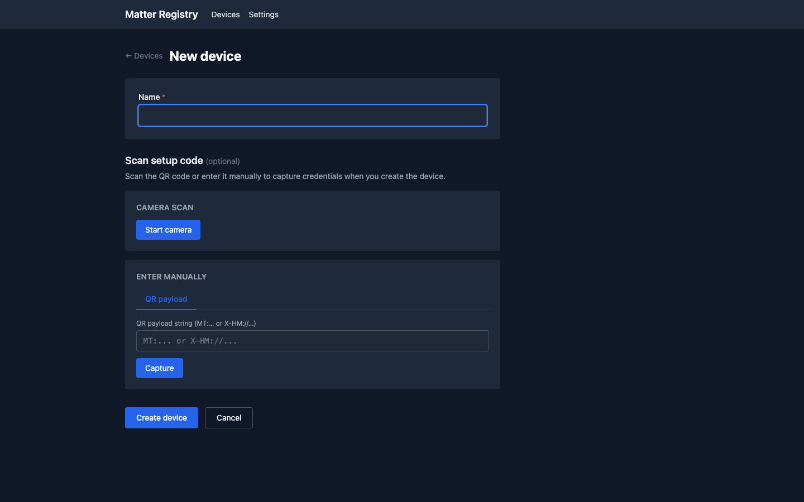
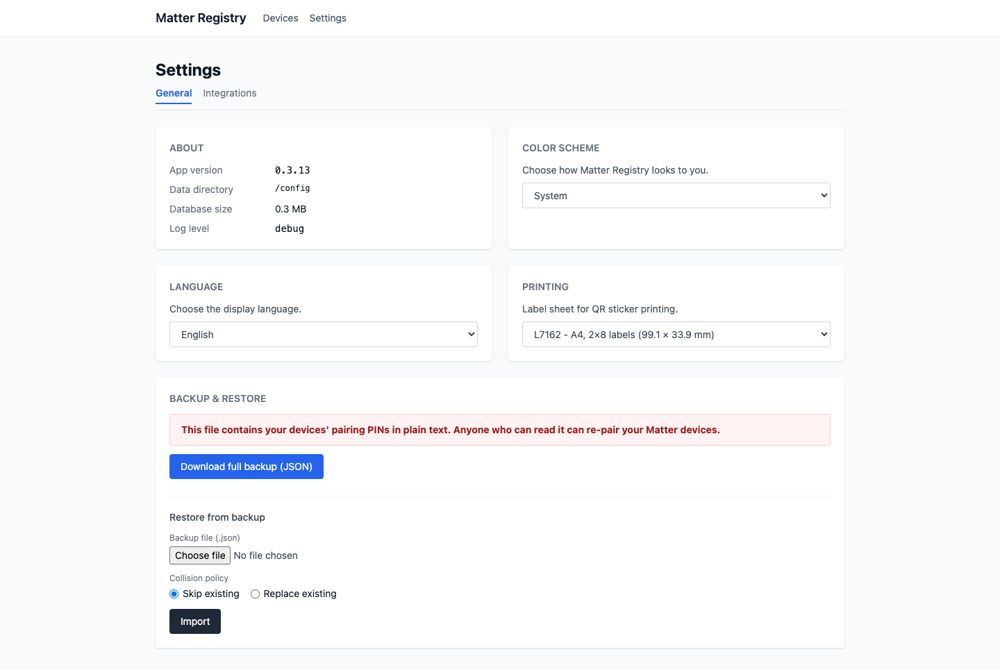

# Matter Registry

> A self-hosted registry for the metadata Matter discards.



## What it does

Matter commissioning tools usually discard setup secrets after the first pairing. That is a problem when you need to pair a device again and the box is long gone. Matter Registry keeps the pairing PIN, setup codes, original QR payload, photos, purchase details, warranty dates, firmware notes, and anything else you want to remember about the device.

From a stored payload, Matter Registry can recreate the QR code and 11-digit manual pairing code. It can also print a sticker for one device or a full sheet on Avery L7162 (A4) or 5162 (US Letter) label stock. Choose the label format under **Settings → Printing**. You can restore a JSON backup on a fresh installation without losing devices, credentials, or photos.

The application has no login screen. It is meant to stay on a private LAN, with access controlled by your network or Home Assistant Ingress.

<table>
  <tr>
    <td width="50%"><br><sub><b>Device detail</b> - identity, the onboarding QR + 11-digit pairing code regenerated from the stored payload, install photos, and every stored property.</sub></td>
    <td width="50%"><br><sub><b>QR sticker sheet</b> - a printable sheet of per-device stickers laid out for Avery label stock.</sub></td>
  </tr>
  <tr>
    <td width="50%"><br><sub><b>Add a device</b> - scan a QR code with the camera or type a setup code by hand.</sub></td>
    <td width="50%"><br><sub><b>Settings</b> - theme, language, print label format, and full-database backup / restore.</sub></td>
  </tr>
</table>

## Install as a Home Assistant App

1. Open Home Assistant → **Settings → Add-ons → ⋮ (overflow menu) → Repositories**.
2. Add the store URL: `https://github.com/Jaano/matterregistry`
3. Refresh the store list, find **Matter Registry**, and click **Install**.
4. Start the App, then click **Open Web UI**.

Home Assistant opens the App through Ingress, so you do not need port forwarding or a reverse proxy. Links continue to work under the Ingress URL.

## Install with Docker

Create a `docker-compose.yml`:

```yaml
services:
  matterregistry:
    image: ghcr.io/jaano/matterregistry:latest
    container_name: matterregistry
    ports:
      - "5591:5591"
    volumes:
      - ./data:/config
    environment:
      - MR_LOG_LEVEL=info
    restart: unless-stopped
```

Then:

```bash
docker compose pull && docker compose up -d
```

Open `http://localhost:5591`. Matter Registry keeps all of its data in one SQLite file at `./data/matterregistry.db`.

> **Camera scanning requires HTTPS.** Browsers only allow `getUserMedia` in a secure context. On a standalone server, use a TLS reverse proxy or open Matter Registry on `localhost`. Manual entry, pasted `MT:` payloads, JSON import, and the REST API still work over plain HTTP. Home Assistant Ingress already provides a secure context.

## Backup and restore

**Settings → Download full backup** creates one JSON file with every device, credential, and attachment. Images are stored in the file as base64. Pairing PINs are plain text, so keep the backup somewhere only you can read.

To restore it, open **Settings → Restore from backup**, choose the file, and decide whether duplicate records should be skipped or replaced.

## Good to know

- Home Assistant, Matter Server, and OpenThread Border Router integrations are optional; when configured, compatibility baselines are Home Assistant 2026.1.1, Python Matter Server 8.0.0, and OpenThread Border Router 3.0.0, with newer capabilities used only when supported.
- The SQLite database and JSON backups contain pairing PINs in plain text. Protect the data directory and backup files with filesystem permissions.
- Matter Registry relies on Home Assistant Ingress or your own reverse proxy for access control. Do not expose port 5591 to the public internet.
- Camera scanning needs HTTPS. This restriction does not affect manual entry, pasted payloads, or JSON imports.
- Sticker printing does not work in the iOS Home Assistant companion app. Its embedded web view (`WKWebView`) does nothing when you tap "Print." Open Matter Registry in Safari on the same iPhone or iPad instead. Printing also works in desktop browsers and on Android.

## License

[Apache License 2.0](LICENSE)
